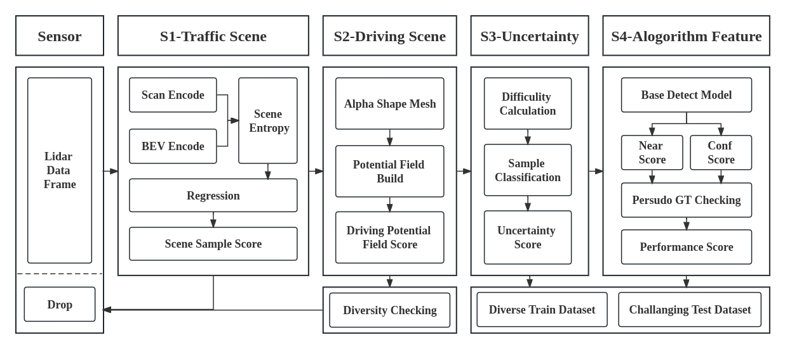

# Active Data Acquisition in Autonomous Driving Simulation



Data collection tools with active data acquisition algorithm implemented for CARLA Simulator.

## News

**2023.9.16** Finish L1 and L3 part, at ``./label_tools/lidar_tool``.

## Dependency

- Ubuntu 20.04

- Python 3.8+

- CARLA 0.9.14

- CUDA 11.1

## Installation

1. Download Carla version 0.9.14 [here](https://github.com/carla-simulator/carla).

2. Build conda environment
   
   ```shell
   cd CARLA_ADA
   conda create -n carla38 python=3.8 & conda activate carla38
   
   pip3 install -r requirements.txt
   ```

## Usage

### Data Recording

1. Start carla, at carla root directory
   
   ```shell
   ./CarlaUE4.sh
   ```

2. Start recorder, execute the command in the root directory
   
   ```shell
   python3 data_recorder.py
   ```
   
   The configuration can be changed by modifying the files in the folder `config`.

3. Make data (image, lidar) to a dataset with labels
   
   ```shell
   python format_helper.py -s <raw_data_directory>
   ```

## Data and Result

| Dataset Name | Total Frames | Map    |
| ------------ | ------------ | ------ |
| D1           | 900          | Town02 |
| D1-S         | 579          | Town02 |
| D2           | 900          | Town02 |
| V            | 375          | Town03 |

| Dataset Name | Vehicle | Training Time | mAP   |
| ------------ | ------- | ------------- | ----- |
| D1           | 996     | 14min40s      | 0.508 |
| D1-S         | 996     | 11min32s      | 0.492 |
| D2           | 1835    | 16min07s      | 0.647 |

## Contributing

Thank you for your interest in contributing to this project! Contributions are highly appreciated and help improve the project for everyone. If you have any questions or need further assistance, please feel free to open an issue.

## Acknowledgments

- [CARLA Simulator](https://carla.org/)
- [CARLA Ros Bridge](https://github.com/carla-simulator/ros-bridge)
- [CARLA_INVS](https://github.com/zijianzhang/CARLA_INVS)

## Citation

> The paper lags behind the code

```
@article{Lai2023ActiveDA,
 title={Active Data Acquisition in Autonomous Driving Simulation},
 author={Jianyu Lai and Zexuan Jia and Boao Li},
 journal={ArXiv},
 year={2023},
 volume={abs/2306.13923}
}
```
